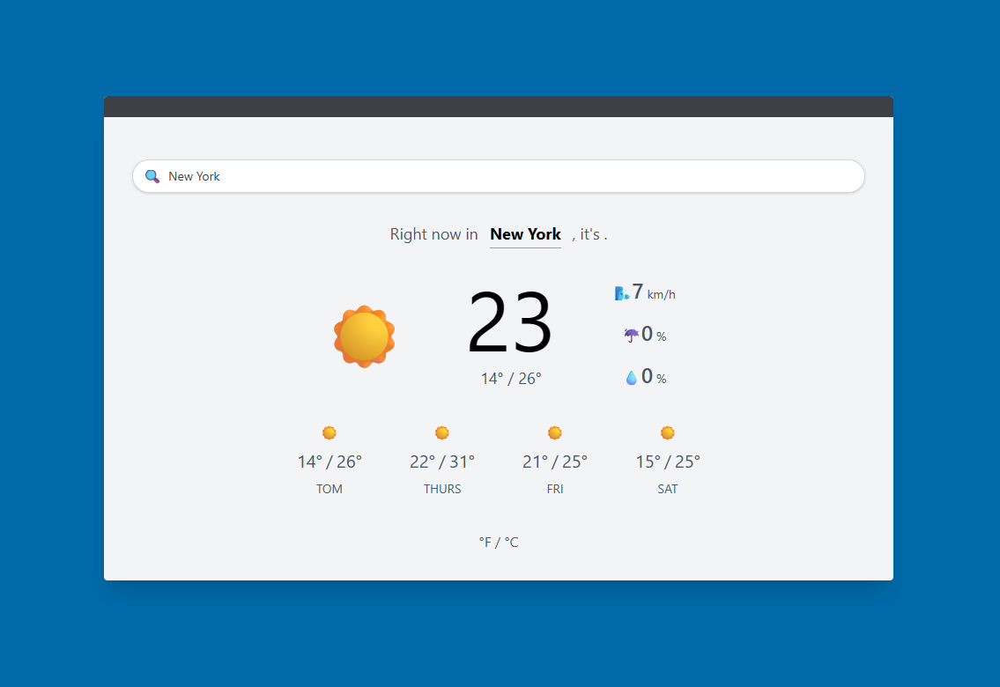

# 🌤️ Weather App


> A modern web application to check the weather in real time for any city — featuring a clean UI, mock data mode, and integration with the [Visual Crossing Weather API](https://www.visualcrossing.com/).

---

## 🚀 Demo

<div align="center">
  
</div>

---

## 🧭 Table of Contents

- [🌤️ Weather App](#️-weather-app)
  - [🚀 Demo](#-demo)
  - [🧭 Table of Contents](#-table-of-contents)
  - [💡 About the Project](#-about-the-project)
  - [✨ Features](#-features)
  - [🛠️ Tech Stack](#️-tech-stack)
  - [⚙️ Installation](#️-installation)
    - [🔧 Requirements](#-requirements)
    - [💻 Steps](#-steps)
  - [📁 Project Structure](#-project-structure)

---

## 💡 About the Project

**Weather App** is a web application built with **HTML**, **JavaScript (ES6 modules)**, and **TailwindCSS** on the frontend, and **Node.js with Express** on the backend.  
It allows users to search for any city and view real-time weather data, including temperature, condition, humidity, and a 3–5 day forecast.

The project was designed to be **simple, educational, and easily extendable**, serving as a learning project.

---

## ✨ Features

- 🔍 Search for cities and display real-time weather data.
- ☁️ Integration with **Visual Crossing Weather API**.
- ⚙️ **Mock mode** for offline testing.
- 📱 Responsive and minimalist design powered by **TailwindCSS**.
- 🌡️ Toggle between °C and °F.

---

## 🛠️ Tech Stack

| Category         | Technologies                                                              |
| ---------------- | ------------------------------------------------------------------------- |
| **Frontend**     | HTML5, TailwindCSS, JavaScript (ES6 Modules)                              |
| **Backend**      | Node.js, Express.js                                                       |
| **External API** | [Visual Crossing Weather API](https://www.visualcrossing.com/weather-api) |
| **Utilities**    | dotenv, node-fetch, CORS                                                  |

---

## ⚙️ Installation

### 🔧 Requirements

- Node.js v18+
- NPM or Yarn
- A valid **Visual Crossing Weather API key**

---

### 💻 Steps

```bash
# 1. Clone the repository
git clone https://github.com/YOUR_USERNAME/weather-app.git
cd weather-app

# 2. Install backend dependencies
npm install

# 3. Create a .env file in the root folder:
# Example:
VITE_API_BASE_URL=http://localhost:3000/api
VITE_USE_MOCK=false
VC_API_KEY=your_visualcrossing_api_key_here

# 4. Run the Node.js server
npm start
# or
node server.js

# 5. Open index.html in your browser (or use a dev server like Vite)
```

## 📁 Project Structure

```bash
📦 WEATHER WEB APP V2
├── 📂 client — Frontend (Vite + Vanilla JS)
│   ├── 📂 public — Static assets
│   ├── 📂 src
│   │   ├── 📂 js — JavaScript modules
│   │   │   ├── 📜 api.js — API requests and data fetching
│   │   │   ├── 📜 event.js — Event listeners and handlers
│   │   │   ├── 📜 helpers.js — Utility and helper functions
│   │   │   ├── 📜 index.js — Entry point for JS logic
│   │   │   └── 📜 ui.js — DOM manipulation and UI rendering
│   │   ├── 🎨 index.css — Global styles
│   │   └── 📜 main.js — App initialization
│   ├── 🧱 index.html — Main HTML template
│   ├── ⚙️ vite.config.js — Vite configuration
│   ├── 🧩 .env.development — Environment variables for dev
│   ├── 🧩 .env.production — Environment variables for prod
│   ├── 📜 package.json — Frontend dependencies and scripts
│   └── 🪄 .prettierrc.json — Code formatter configuration
│
├── 📂 server — Backend (Node.js + Express)
│   ├── 📜 server.js — Main server entry point
│   ├── 📜 mock.json — Mock API data (optional)
│   ├── 🧩 .env — Environment variables
│   ├── 📜 package.json — Backend dependencies and scripts
│   └── 📂 node_modules
│
├── ⚙️ .gitignore — Git ignored files
└── 📝 README.md — Project documentation
```
